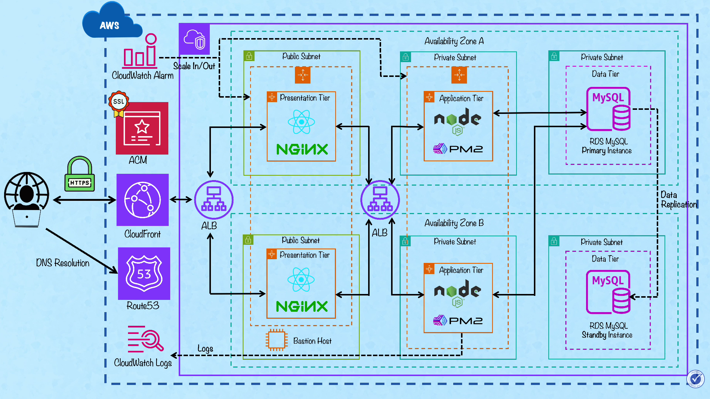

# **Three-Tier AWS Architecture – Terraform Project**

## **📌 Architecture Diagram**

```md

```


---

# **📝 Overview**

This project deploys a **highly available, secure, and scalable production 3-Tier Architecture on AWS** using Terraform.
The architecture includes:

* **Edge Layer: Amazon CloudFront** → for content delivery and caching.
* **Presentation Tier (Public Subnet)** → NGINX (React) behind a Public ALB.
* **Application Tier (Private Subnet)** → Node.js + PM2 behind an Internal ALB.
* **Data Tier (Private Subnet)** → Amazon RDS (MySQL) with Multi-AZ replication.
* **Management** → Bastion Host for secure SSH access.
* **Monitoring** → CloudWatch Logs for centralized logging.
* **Scaling** → CloudWatch Alarms triggering Auto Scaling policies

--- 

# **⚙ Technologies Used**

* **Terraform IaC**
* **AWS Core:** VPC, EC2, RDS, Route53, ACM
* **Delivery & Load Balancing:** CloudFront, Application Load Balancer (x2)
* **Monitoring:** CloudWatch (Alarms & Logs)
* **Server Stack:** NGINX, Node.js + PM2, MySQL

---

# **🔐 Security Design**
# 🔐 Security Design

| Layer               | Security Measure                                                                  |
| ------------------- | --------------------------------------------------------------------------------  |
| **Edge Security**   | CloudFront handles HTTPS termination and provides DDoS protection                 |
| **Public Subnet**   | Only Public ALB and Bastion Host are exposed to the internet                      |
| **Internal Traffic**| Internal ALB routes traffic from Web tier to App tier (no direct instance access) |
| **Access Control**  | Bastion Host acts as the single entry point for SSH management                    |
| **Private Subnet**  | Application and Database instances have no public IPs                             |
| **DB Subnet**       | MySQL accessible only from Application Security Group                             |
| **Encryption**     | ACM-managed SSL certificates used at Load Balancers                                |
| **Outbound Access**| NAT Gateway allows secure outbound internet access for private resources           |


---

# **🔁 Request Flow**

1. User accesses **[https://yourdomain.com](https://yourdomain.com)**
2. Route53 resolves DNS to CloudFront Distribution.
3. CloudFront forwards request to the Public ALB.
4. Public ALB routes to NGINX (Presentation Tier) in Public Subnet.
5. NGINX proxies API requests to the Internal ALB.
6. Internal ALB balances load to Node.js (Application Tier) in Private Subnet.
7. Node.js writes/reads from RDS MySQL (Data Tier).
8. Logs are pushed to CloudWatch and alarms trigger scaling if load increases.

---


# **📦 Features**

* Global Content Delivery: CloudFront integration for low-latency access.
* Dual-Layer Load Balancing: Separate ALBs for public and internal traffic.
* Auto-Scaling: CloudWatch alarms trigger Scale In/Out actions based on load.
* Multi-AZ High Availability: Redundancy across Zone A & B.
* Secure Management: Dedicated Bastion Host for administrative tasks.
* Centralized Logging: Instance logs streamed directly to CloudWatch Logs.
* Database Redundancy: Automatic RDS standby replication.
---

